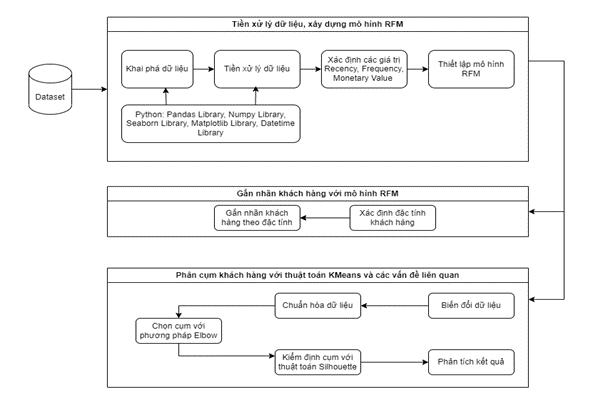

# RFM K-means Customer Segmentation
This Jupyter notebook provides a Python implementation for customer segmentation using RFM (Recency, Frequency, Monetary) analysis combined with K-means clustering. The purpose is to group customers based on their purchasing behavior to identify valuable segments for targeted marketing strategies.

## Models
<p align="center">
  
</p>

## Installation
The notebook utilizes various Python libraries. Ensure you have them installed, especially if you plan to run the code locally. The required libraries include:
```
Pandas
NumPy
Matplotlib
Seaborn
Plotly
DateTime
Category Encoders
Scikit-learn
Imbalanced-learn (imblearn)
SciPy
```
## File Structure
- `RFM_Kmean_for_Customer_Segmentation.ipynb`: The main Jupyter notebook containing the code.
- `AdventureWorksSales.xlsx`: Dataset containing sales, customer, product, and territory information.

## Importing Libraries and Functions
The notebook starts by importing necessary libraries and functions for data processing, visualization, and modeling. The libraries include Pandas, NumPy, Matplotlib, Seaborn, Plotly, DateTime, Category Encoders, Scikit-learn, and others.

## Pre-processing the Data
The dataset is loaded from the 'AdventureWorksSales.xlsx' file, containing sales order, territory, product, and customer information. Data pre-processing steps include handling missing values, transforming data, and performing exploratory data analysis (EDA).

## Exploratory Data Analysis (EDA)
EDA is conducted to understand the distribution of variables, detect outliers, and identify patterns in the data. Visualizations such as histograms, box plots, pair plots, and correlation matrices are utilized for analysis.

## RFM Segmentation
RFM (Recency, Frequency, Monetary) analysis is performed to segment customers based on their purchasing behavior. Customers are assigned RFM scores and segmented into groups accordingly.

## K-means Clustering
K-means clustering is applied to the RFM data to further segment customers into distinct groups based on similarities in their RFM scores. The optimal number of clusters is determined using techniques like the elbow method and silhouette analysis.

## Results and Visualization
The results of the segmentation are visualized using scatter plots, snake plots, and cluster summaries. Each cluster's characteristics and key insights are analyzed to derive actionable marketing strategies.

## Conclusion
The notebook concludes with insights derived from the customer segmentation analysis and recommendations for marketing strategies targeting different customer segments.
Customer Segmentation in Marketing Using RFM and Machine Learning
This project is the final assignment for the interdisciplinary research methods course at the University of Economics and Law, focusing on customer segmentation in marketing using RFM (Recency, Frequency, Monetary) analysis combined with machine learning techniques.

Table of Contents
Introduction
Project Overview
Research Methods
Technologies Used
Installation
Usage
Contributors
Acknowledgments
License
Introduction
In marketing and any business field related to customer service, understanding and effectively targeting customers is crucial. This project aims to segment customers into different groups based on their behavior and value using the RFM model and machine learning techniques. This segmentation helps businesses to tailor their marketing strategies more effectively.

Project Overview
This research combines traditional marketing segmentation methods with modern data science techniques. By applying the RFM model and K-means clustering, the project segments customers into distinct groups, providing insights for personalized marketing strategies.

Objectives
To analyze customer segmentation in marketing using the RFM model combined with machine learning.
To provide actionable insights for better customer management and business growth.
To develop a comprehensive model that integrates theories and methods from previous studies.
Research Methods
The project utilizes a combination of quantitative and qualitative research methods:

Literature Review: Reviewing existing research on customer segmentation and machine learning applications in marketing.
Data Collection: Using sales and customer data from AdventureWorks Cycles.
Data Analysis: Applying Exploratory Data Analysis (EDA) and data preprocessing techniques.
Model Implementation: Using RFM analysis and K-means clustering for segmentation.
Evaluation: Assessing the model using metrics such as the Elbow method and Silhouette score.
Technologies Used
Programming Language: Python
Libraries: Pandas, NumPy, Scikit-learn, Matplotlib, Seaborn
Tools: Jupyter Notebook
Installation
To run this project locally, follow these steps:

Clone the repository:

bash
Sao chép mã
git clone https://github.com/yourusername/customer-segmentation.git
Navigate to the project directory:

bash
Sao chép mã
cd customer-segmentation
Create a virtual environment:

bash
Sao chép mã
python3 -m venv venv
Activate the virtual environment:

On Windows:
bash
Sao chép mã
venv\Scripts\activate
On MacOS/Linux:
bash
Sao chép mã
source venv/bin/activate
Install the dependencies:
``` bash
pip install -r requirements.txt
```
## Usage
1. Prepare the data: Place your dataset in the `data/` directory.
2. Run the Jupyter Notebook:
```bash
jupyter notebook
```
3. Open and run the notebook: Open customer_segmentation.ipynb and run the cells to see the analysis and results.

## Contributors
Nguyen Duy Duan, Bui Chanh Thien, Le Thi Thu Tinh, Le Huong Giang, Nguyen Thuy Tram.

## Acknowledgments
We extend our sincere gratitude to our professors, PGS.TS. Hồ Trung Thành and ThS.Nguyễn Văn Hồ, for their guidance and support. We also thank the University of Economics and Law for providing us with the resources and knowledge to complete this project.
